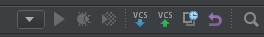

# template-js
This repository holds the UOIT 3700 Database Management Systems template server that connects to a MySQL database and acts as an external API.

# Setup
- [Windows](#windows-setup)
- [Linux](#linux-setup)
- [Webstorm Setup](#webstorm-ide-setup)
- [Running Project](#run-project)

# Windows Setup
- Install git [if not already installed](https://git-scm.com/download/win)
- Clone project *run in cmd as admin*
```
git clone https://github.com/sealneaward/template-js
```
- Install [Node.JS](https://nodejs.org/en/download/)
- Install dependencies *run in cmd as admin in project folder*
```
npm install
```
- Install [MySQL](http://dev.mysql.com/downloads/installer/)
- When installing, make sure to include the MySQL Workbench in the installation

### MySQL Database Setup
- TODO
- When creating a database, make sure to create a database with the following info

| Database       | Username           | Password  |
| ------------- | ------------- | ----- |
| template    | root | root |

# Linux Setup
- Install git if not already installed
```
sudo apt-get install git
```
- Clone project
```
git clone https://github.com/sealneaward/template-js
```
- Install Node.JS
```
curl -sL https://deb.nodesource.com/setup_6.x | sudo -E bash -
sudo apt-get install -y nodejs
```
- Install dependencies *run in project folder*
```
sudo npm install
```
- Install MySQL
```
sudo apt-get install mysql-server mysql-workbench
```

### MySQL Database Setup
- TODO
- When creating a database, make sure to create a database with the following info

| Database       | Username           | Password  |
| ------------- | ------------- | ----- |
| template    | root | root |

# Webstorm IDE Setup
- download and install [Webstorm](https://www.jetbrains.com/webstorm/)
- you can get a free license from JetBrains if you are a [student](https://www.jetbrains.com/student/)
- to configure the IDE to accept ECMAScript 6 javascript go to `File > Settings > Frameworks & Languages > Javascript` and select *ECMAScript 6* in the dropdown


### Webstorm Debugging
- click on the dropdown arrow  and select edit configurations
- add a Node.JS configuration with the following settings


# Run Project
- first populate database *run in project folder*
```
npm run populate
```
- run the web server
```
npm run start
```
### Testing
- this can be removed
